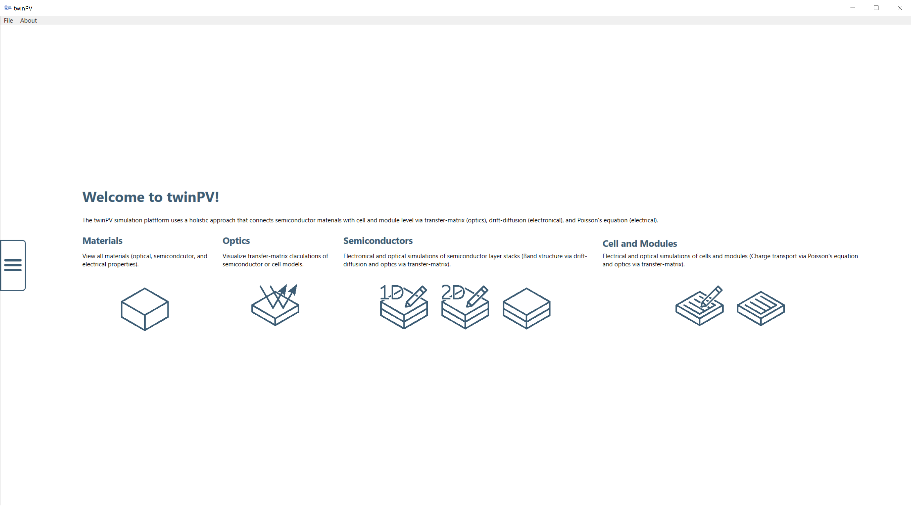
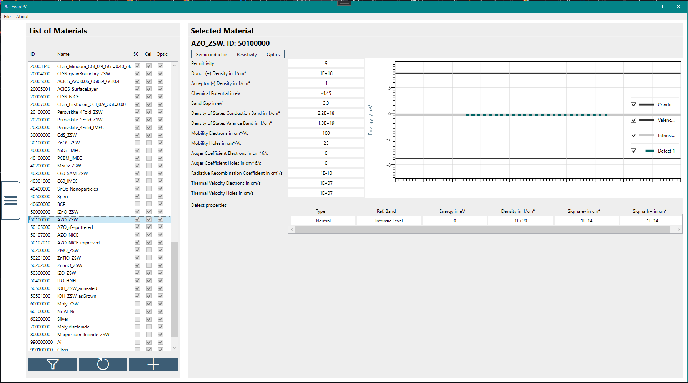
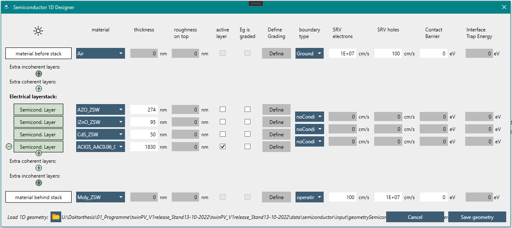
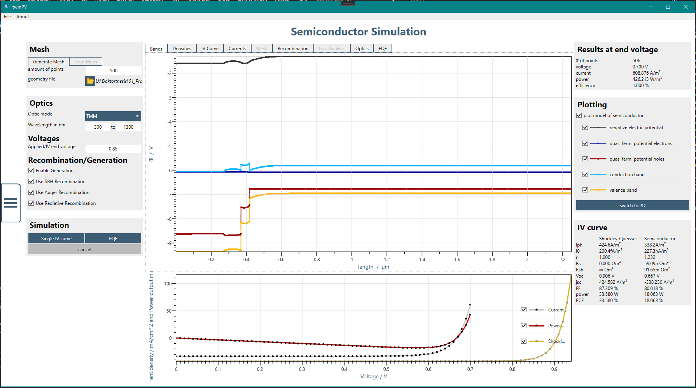
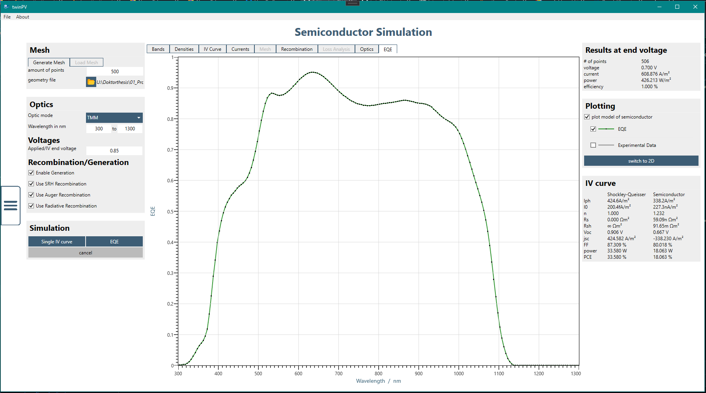
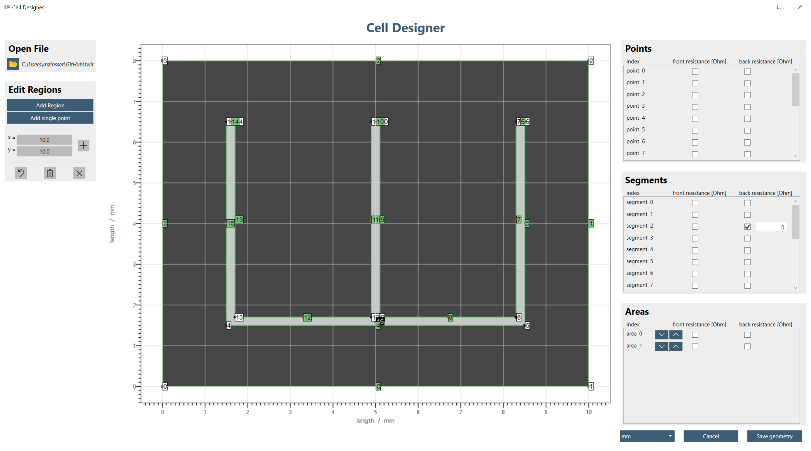
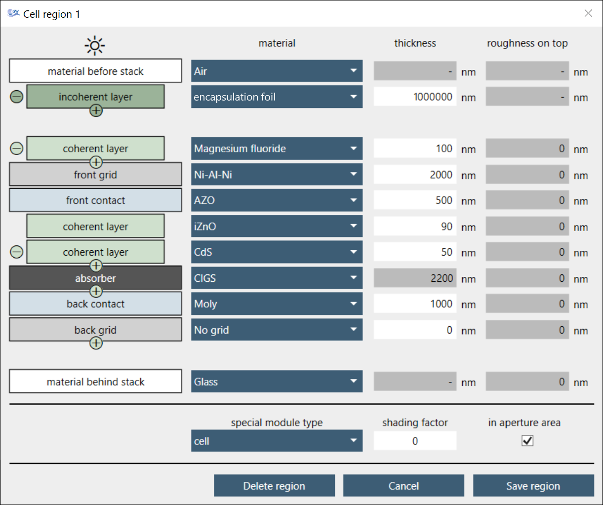
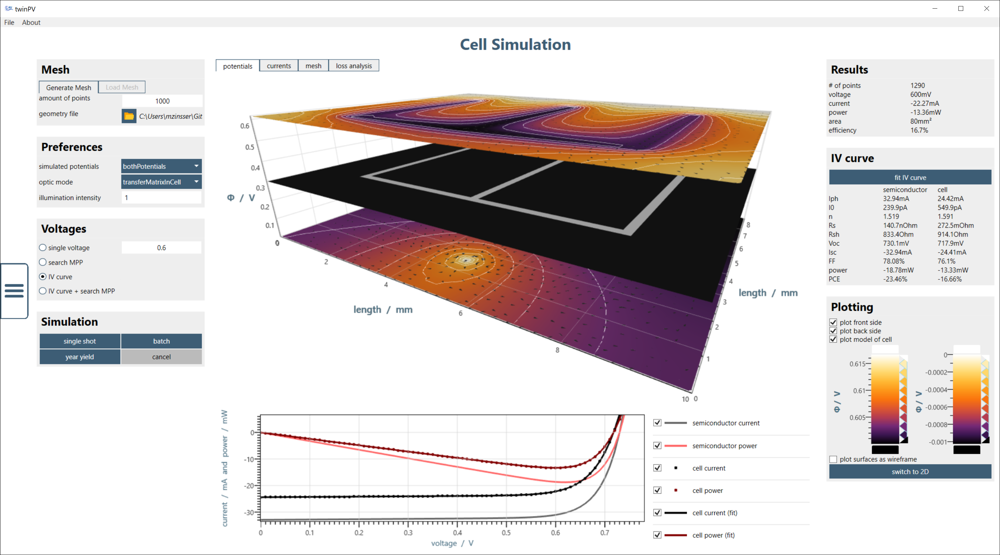
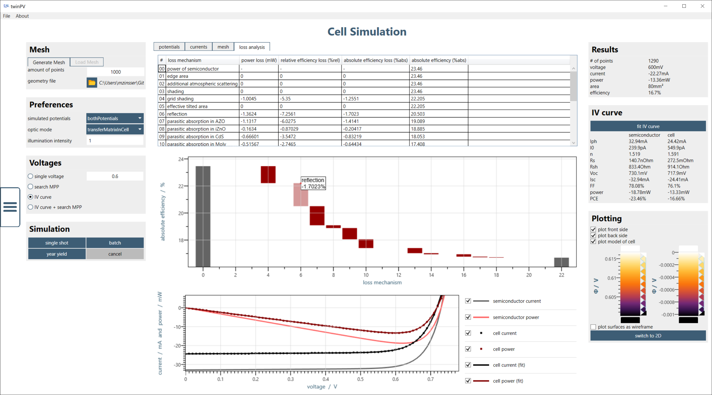

# twinPV
This programm enables the simulation of thin-film solar cells and modules. Using materials data, the layers for contacts and semiconductors are defined by the user within a cell configurator. The cell has a defined area and an optional metallization grid. In a similar way, modules with monolithic interconnection can be simulated. Charge carrier generation is calculated based on light arriving to the absorber layer after accounting for scattering, reflection, and attenuation by preceding layers using the transfer matrix method. The collection of the generated current is determined by the calculated band diagram and the properties of the contact layers including their geometry. The photovoltaic performance is determined based on calculated current-voltage curves.  Spectral response / quantum efficiency curves are also available. In addition, yield calculations over several years are also possible. Loss analyses are useful for interpreting the results. These can be created for both the solar devices and the yield results.

## Cite Papers
If you use the code or the information of this repository, please cite this repository itself and the following scientific papers:
> A. Bauer, T. Helder, M. Zinßer,
> [*Simulation platform twinPV. Internally developed at ZSW*](https://github.com/ZSW-MAT/twinPV) (2022)

> M. Zinßer, T. Helder, T. Magorian Friedlmeier, A. Bauer, T. Kirchartz, U. Rau, R. Wächter, M. Powalla,
> [*Holistic Yield Modeling, Top-Down Loss Analysis, and Efficiency Potential Study of Thin-Film Solar Modules*](https://www.nature.com/articles/s42005-023-01164-6),
> Communications Physics 6, 55 (2023)

> M. Zinßer, T. Helder, A. Bauer, T. Magorian Friedlmeier, J. Zillner, J.-P. Becker, M. Powalla,
> [*Optical and electrical loss analysis of thin-film solar cells combining the methods of transfer-matrix and finite elements*](https://ieeexplore.ieee.org/abstract/document/9839509/),
> IEEE Journal of Photovoltaics 12, 1154–1161 (2022)

## Use of the code and program
For the use of the simulation program this repository offers either the possibility to execute the executable ("twinPV.exe") which is available in the following directory: twinPV/bin/Debug/. Alternatively, the code can be executed via a suitable IDE. Microsoft Visual Studio is the recommended IDE for this. Additionally, the plotting libary AtmoicusChart is necessary for compiling the code. One can get a trial version of the libary at https://atomicuschart.com/.

## Screenshots
The following screenshots demostrate the look of the program. For further details, tutorial videos (in German) are available on YouTube (https://www.youtube.com/playlist?list=PLmH0I8-LTep-DmE2RSmIBFM5AjIt8xvOH) to guide users through the software.

Homescreen

Materials (only preview, no changes possible)

Semiconductor model designer

Semiconductor simulation 

Semiconductor EQE simulation

Device designer

Region designer (within celldevice designer)

Device simulation

Device loss analysis

